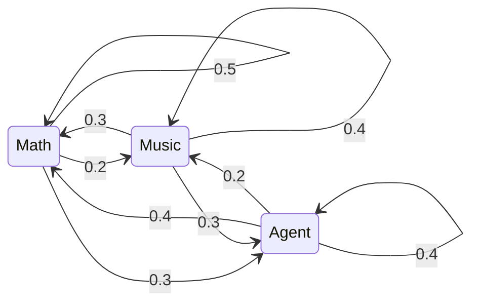

𝑃(𝑋ₙ₊₁ ∣ 𝑋ₙ) ⚛️

<!--
**dersteppenwolfruowen-316/dersteppenwolfruowen-316** is a ✨ _special_ ✨ repository because its `README.md` (this file) appears on your GitHub profile.

Here are some ideas to get you started:

- 🔭 I’m currently working on ...
- 🌱 I’m currently learning ...
- 👯 I’m looking to collaborate on ...
- 🤔 I’m looking for help with ...
- 💬 Ask me about ...
- 📫 How to reach me: ...
- 😄 Pronouns: ...
- ⚡ Fun fact: ...
-->

 

„Wahrheit und ewige Liebe sind die treibenden Kräfte meines Lebens.“

`MS Information Science @ Cornell` `Open to AI / Applied Math research`

- Currently an information science master's student at Cornell
- Exploring LLM / VLM / agents
- Open to AI or applied mathematics research positions
- I like math and music

---

**知行合一。**

未来总是足够绵延，不是吗？

$$P(X_{n+1}\mid X_n, X_{n-1}, \dots, X_1) = P(X_{n+1}\mid X_n)$$

