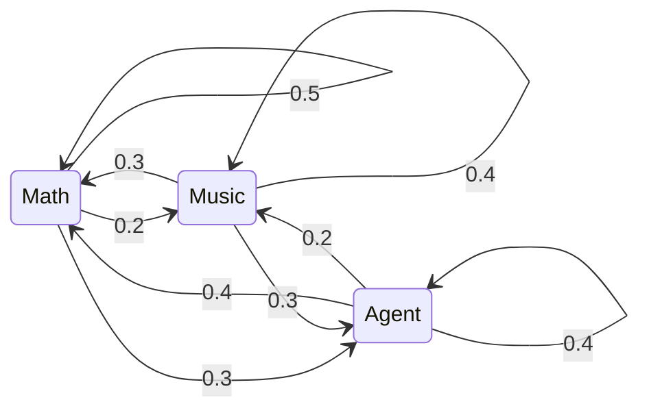

𝑃(𝑋ₙ₊₁ ∣ 𝑋ₙ) ⚛️

 

„Wahrheit und ewige Liebe sind die treibenden Kräfte meines Lebens.“

- Currently an information science master's student at Cornell
- Exploring LLM / VLM / agents
- Open to AI or applied mathematics research positions
- I like math and music

---

**知行合一。**

未来总是足够绵延，不是吗？

$$P(X_{n+1}\mid X_n, X_{n-1}, \dots, X_1) = P(X_{n+1}\mid X_n)$$

